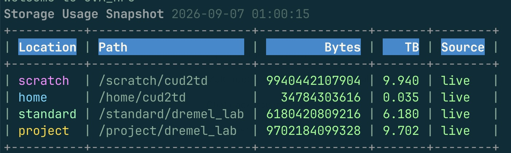

# Rivanna Storage Options

A reference for the storage locations available to Dremel Lab members on UVA's Rivanna HPC, when to use each one, real measured I/O performance, and the scripts we run to keep `/scratch` clean and to track how full each location is.

> **Status:** Work in progress — this guide will be revised as we gather more data and scripts. Feedback welcome.

## Overview

Rivanna exposes several distinct storage locations, each with different quotas, sharing rules, snapshot policies, and (critically) very different I/O performance. Picking the wrong one for a workload is a common source of "why is this pipeline so slow" reports — see [Key Points](#key-points) below.

## Storage Locations

| Storage Location | Size/Quota   | Shareable | Snapshots     | Automatic Purge                    | Recommended Use            |
| ----------------- | ------------ | --------- | ------------- | ----------------------------------- | --------------------------- |
| `/home`            | 200 GB       | No        | Daily, 1 week | No                                  | Code, scripts, documents    |
| `/scratch`         | 10 TB        | No        | None          | Files inactive for 90 days deleted  | Active HPC computations     |
| `/project`         | 1 TB+ leased | Yes       | Daily, 1 week | No                                  | Shared HPC project data     |
| `/standard`        | 1 TB+ leased | Yes       | None          | No                                  | Long term research storage  |

Dremel Lab's shared paths follow this pattern:
- `/project/dremel_lab` — shared, fast, holds pipeline code, reference genomes/indices, and shared tooling (e.g. `/project/dremel_lab/scripts`) — not per-run pipeline I/O, which goes on `/scratch`
- `/standard/dremel_lab` — shared, slow, used for long-term archival of raw data and finished results
- `/scratch/<username>` — per-user scratch for transient pipeline working directories

## Pipeline Data Workflow

Given the quota/sharing/performance tradeoffs above, Dremel Lab pipelines (HAROLD, Chroma2, etc.) follow a consistent storage pattern rather than reading/writing any one location for everything:

```
/standard/dremel_lab        /project/dremel_lab
  (raw FASTQs, archival)      (pipelines, reference genomes/indices — shared, fast)
        │                              │
        │ Globus transfer              │ used throughout
        ▼                              ▼
  /scratch/<user>  ◄── manifest points here ──► pipeline run (workdir on scratch)
        │
        │ on completion
        ▼
       S3  (final results — hot/cold tiers)
```

1. **Raw FASTQs live on `/standard`** — write-once, read-rarely archival storage; this is where sequencing data lands and stays long-term.
2. **Pipeline code and references live on `/project`** — Snakemake/Nextflow pipelines, conda/mamba envs, reference genomes and indices are shared, need fast I/O, and are reused across many runs, so they belong on `/project`, not `/standard`.
3. **Before a run, FASTQs are Globus-transferred from `/standard` to `/scratch/<user>`** — this makes a fast working copy so the pipeline never has to read raw input at `/standard` speeds (see [I/O Performance](#io-performance-standard-vs-project) below).
4. **The sample manifest/samplesheet points at the `/scratch` copy**, not the `/standard` original — this is what actually puts the pipeline on the fast path; a manifest still pointing at `/standard` paths would silently reintroduce the 15-20x slowdown.
5. **The pipeline's working directory (`WORKDIR`, intermediate/temp files) is also on `/scratch`** — `/scratch` has the room (10 TB) and speed for heavy read/write during a run, and its 90-day auto-purge plus [`cleanup_uuid_dir`](#scratch-cleanup) keep it from filling up with stale run artifacts.
6. **On completion, final results are transferred to S3**, not back to `/standard`. Both HAROLD and Chroma2 run an optional post-run pipeline stage (`push_to_s3: true` in `config.yaml`) that `aws s3 sync`s curated outputs from `/scratch` to `s3://dremel-lab-bucket/_HTS/<PIPELINE>/<sample_set_name>/...` — verifying the transfer by checksum before deleting anything local. If the transfer fails or can't be verified, the local `/scratch` copy is left in place and the pipeline raises an error rather than silently losing data. Storage class is assigned per file type to control cost: large, rarely-touched alignment files (BAM/BAI) go to **Glacier** (cheapest, restore takes hours — see [Understanding S3 Storage Classes](../s3-globus-access/s3_globus_access_guide.md#understanding-s3-storage-classes-file-restoration) in the S3/Globus guide); everything else (QC reports, count matrices, bigwigs/bigbeds, peaks, configs) goes to **Glacier Instant Retrieval** for near-immediate access. This keeps finished outputs off Rivanna's leased/quota'd storage entirely, while remaining downloadable via Globus.

**Why not run pipelines directly off `/standard` or `/project`?** `/standard` is far too slow for active I/O (see below). `/project` is shared and leased (limited, costs money to expand) — it's kept for code and references, not bulk per-run working data, so heavy pipeline I/O doesn't compete with everyone else's shared tooling or eat into the lease.

## I/O Performance: `/standard` vs `/project`

We benchmarked `/standard` against `/project` (and `$HOME` as a baseline) after noticing pipelines and even `conda env list` hanging when reading/writing under `/standard`. Full write-up: [seqinfomics_eln#41 — Slowness in loading conda env](https://github.com/dremellab/seqinfomics_eln/issues/41).

Test: `dd` with `bs=1G count=1` and `oflag=direct`/`iflag=direct` (bypasses page cache, so this reflects real filesystem throughput).

| Operation | Path                    | Time (s) | Speed     |
| --------- | ------------------------ | -------- | --------- |
| Write     | `/standard/dremel_lab/`  | 12.2573  | 87.6 MB/s |
| Write     | `/project/dremel_lab/`   | 0.5856   | 1.8 GB/s  |
| Write     | `$HOME/`                 | 0.8339   | 1.3 GB/s  |
| Read      | `/standard/dremel_lab/`  | 15.0694  | 71.3 MB/s |
| Read      | `/project/dremel_lab/`   | 0.8339   | 1.3 GB/s  |
| Read      | `$HOME/`                 | 0.8784   | 1.2 GB/s  |

**Takeaway:** `/standard` is roughly **15-20x slower** than `/project` or `$HOME` for both reads and writes. This makes sense given `/standard` isn't designed for active I/O (no snapshots either — see table above), but it means:
- Never point active pipeline `WORKDIR`/temp directories at `/standard`
- Never run tools (e.g. `conda`/`mamba` envs) directly out of `/standard`
- Use `/standard` only for data that is written once and read rarely (long-term archival)
- Stage data to `/project` or `/scratch` before compute-heavy read/write steps, then move final results back to `/standard` for archival

## Scratch Cleanup

`/scratch` auto-purges files inactive for 90 days, but pipeline runs (Snakemake `.snakemake` work dirs, tool temp dirs, etc.) commonly leave behind UUID-named temp directories well before that. We run a scheduled cleanup script for these:

**[`cleanup_uuid_dir`](https://github.com/dremellab/scripts/blob/develop/bin/cleanup_uuid_dir)** — scans `/scratch/$USER` and `/scratch/$USER/tmpdir` for directories named as UUIDs (`^[0-9a-fA-F]{8}-...`) that are older than 10 days, reports total space that would be freed, and deletes them when run with `--delete` (dry-run by default).

**Location on Rivanna:** `/project/dremel_lab/scripts/bin/cleanup_uuid_dir`

```bash
cleanup_uuid_dir            # dry run — reports what would be deleted
cleanup_uuid_dir --delete   # actually deletes
```

Scheduled nightly via Slurm `scrontab` (see [`config/scrontab.conf`](https://github.com/dremellab/scripts/blob/develop/config/scrontab.conf)):

```
0 0 * * * /project/dremel_lab/scripts/bin/cleanup_uuid_dir --delete
```

## Storage Usage Reporting

Two companion scripts track how full each storage location is over time:

**[`storage_usage`](https://github.com/dremellab/scripts/blob/develop/bin/storage_usage)** — measures `/scratch/$USER`, `$HOME`, `/standard/dremel_lab`, and `/project/dremel_lab` in parallel using [`dust`](https://github.com/bootandy/dust) (run `nice`/`ionice`'d so it doesn't hog I/O), and appends a timestamped row per location to `$HOME/storage_usage.tsv`. Falls back to the last cached measurement for a location if a scan times out (default 600s) or fails, so the log always has a value even when a directory is too large to fully walk in time.

**Location on Rivanna:** `/project/dremel_lab/scripts/bin/storage_usage`

Run nightly via `scrontab`:
```
0 1 * * * /project/dremel_lab/scripts/bin/storage_usage
```

**[`storage_usage_report`](https://github.com/dremellab/scripts/blob/develop/bin/storage_usage_report)** — reads `storage_usage.tsv` and prints a colorized table of the latest measurement for a given day (defaults to today), color-coding `NA`/failed measurements and marking cached (stale) values distinctly from live ones.

**Location on Rivanna:** `/project/dremel_lab/scripts/bin/storage_usage_report`

```bash
storage_usage_report                        # today's snapshot, from $HOME/storage_usage.tsv
TARGET_DATE=2026-09-01 storage_usage_report  # a specific date
```

**Example output:**



In a terminal, each `Location` row is color-coded (scratch/home/standard/project), and the `Bytes`/`TB`/`Source` columns are colored green for a live measurement, yellow for a cached (stale) fallback, and red for `NA`/failed — so a scan at a glance shows which locations are running low on quota and whether the numbers are fresh.

All three scripts live under `/project/dremel_lab/scripts/bin` on Rivanna, and are made available on `$PATH` to every `dremel_lab` group member who sources `.sh_common` in their `~/.bashrc`:

```bash
source /project/dremel_lab/scripts/.sh_common
```

(see the [scripts repo README](https://github.com/dremellab/scripts/blob/develop/README.md)) — once sourced, you can just run `cleanup_uuid_dir`, `storage_usage`, or `storage_usage_report` from anywhere without the full path.

## Finding What's Eating Your Space with `dust`

`storage_usage` tells you a location is, say, 90% full — but not *which folder inside it* is the actual culprit. For that, use [`dust`](https://github.com/bootandy/dust) (the same tool `storage_usage` runs under the hood) instead of the classic `du -sh *`.

`du` walks every single file one at a time, which on a shared, high-latency filesystem like `/scratch` or `/standard` can take many minutes (or longer) to scan a busy directory — and at the end you still just get a flat, unsorted wall of numbers you have to eyeball to find the big one. `dust` walks the same files but in parallel and stops early once it has enough info to rank folders by size, so it finishes far faster on the same directory — and it hands you the answer already sorted biggest-first with a little bar next to each folder, so the space hog jumps right out at you instead of you having to scroll and compare numbers yourself.

**Location on Rivanna:** `/project/dremel_lab/cargo/bin/dust` (just `dust` on your `$PATH` once you've sourced `.sh_common` — see above)

**Example command:**

```bash
dust --depth 2 --only-dir --full-paths --limit-filesystem /scratch/$USER/
```

**What each flag does, in plain terms:**

- **`--depth 2`** — Only look 2 folders deep. Left unlimited, `dust` will crawl every subfolder all the way down, which is slow and buries you in results you don't need yet. Depth 2 gives you a quick "top of the iceberg" view — you can always point it deeper into whichever folder turns out to be the problem.
- **`--only-dir`** — Only show folders, not individual files. Right now you're hunting for *which directory* is huge, not staring at every file in it — that's the next step, once you've narrowed it down.
- **`--full-paths`** — Print the entire path (e.g. `/scratch/cud2td/HAROLD_run_2026/tmp`) instead of a shortened name. You'll want to copy that path straight into a `cd` or `rm -rf` — not guess where it actually lives.
- **`--limit-filesystem`** — Don't wander off onto a different mounted filesystem while scanning. `/scratch`, `/home`, `/project`, and `/standard` are all separate filesystems; without this flag `dust` can follow a symlink or mount point onto a totally different (and much bigger, or much slower) filesystem, which either takes forever or gives you misleading numbers.
- **`/scratch/$USER/`** — The folder to scan. `$USER` just fills in your own username, so this points at your own scratch directory.

**How to actually use it:**

1. Run the command above.
2. `dust` prints your biggest subfolders (2 levels deep), each with a bar showing how much space it takes relative to the others.
3. See a huge folder? `cd` into it and run `dust` again (or drop `--only-dir` to see individual files) to zoom in on exactly what's inside.
4. Once you know what's safe to remove — old pipeline temp dirs, leftover `.snakemake` work directories, duplicate FASTQs, stray core dumps — clean it up yourself, or let [`cleanup_uuid_dir`](#scratch-cleanup) handle the UUID-temp-dir case automatically.

## Getting HPC-Specific Help from Research Computing

Not every storage problem is something Dremel Lab's scripts or the lab PI can fix. Filesystem outages, quota increases, mount/permission errors, and Rivanna-wide performance issues are owned by **UVA Research Computing (RC)**, not the lab — for those, go straight to RC support rather than `#dremellab`.

**Before filing a ticket:** check the [System Status page](https://www.rc.virginia.edu/system-status) — your issue might already be a known, in-progress incident.

**How to open a ticket:**

- **Email (preferred by the lab):** hpc-support@virginia.edu — quicker to write, keeps a thread you can reply on, and RC turns it into a ticket automatically. This is Dremel Lab's default way of reaching RC; use it unless you have a reason to use the form instead.
- **Web form:** [forms.rc.virginia.edu/form/support-request/](https://forms.rc.virginia.edu/form/support-request/) — set **Support Category** to **HPC** (or **Storage** for a quota/filesystem-specific issue), then fill in "Brief description of your request" and "Details of your request" (the form just says to "provide as much detail as possible" — see below for what that means in practice)

**What to include so it doesn't bounce back asking for more info:**

- Full path of the affected storage location (e.g. `/scratch/cud2td`, `/standard/dremel_lab`)
- The exact error message or command output — not a paraphrase
- When it happened (date/time), and whether it's reproducible
- Group/allocation: `dremel_lab`
- Slurm job ID, if it happened during a job

**Less urgent, non-broken questions:** RC also holds weekly office hours — [Tuesdays](https://rc.virginia.edu/events/office-hours-every-tuesday) and [Thursdays](https://rc.virginia.edu/events/office-hours-every-thursday) — a good fit for "what's the right way to do X" questions that aren't worth a ticket.

## Key Points

- `/standard` is 15-20x slower than `/project` or `$HOME` for I/O — archival only, never active compute
- `/project` holds shared pipeline code, references, and tooling — fast and shared, but per-run pipeline I/O (workdirs, temp files) belongs on `/scratch`, not here
- `/scratch` auto-purges after 90 days, but `cleanup_uuid_dir` proactively removes stale pipeline temp dirs after 10 days
- `storage_usage` + `storage_usage_report` give a daily, per-location usage snapshot — check before a large job to avoid quota surprises
- When a location is full, run `dust` yourself to drill down and find *which folder* is the actual culprit
- Filesystem/quota/outage issues go to HPC Support (hpc-support@virginia.edu, our preferred contact method), not `#dremellab`
