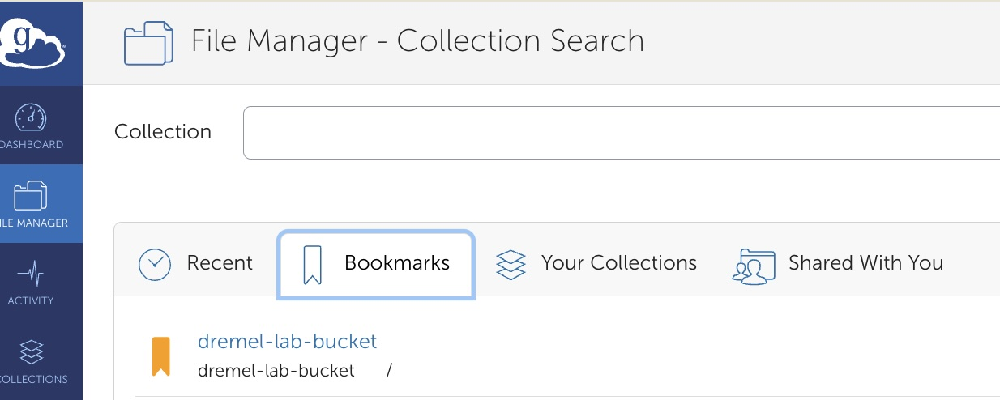
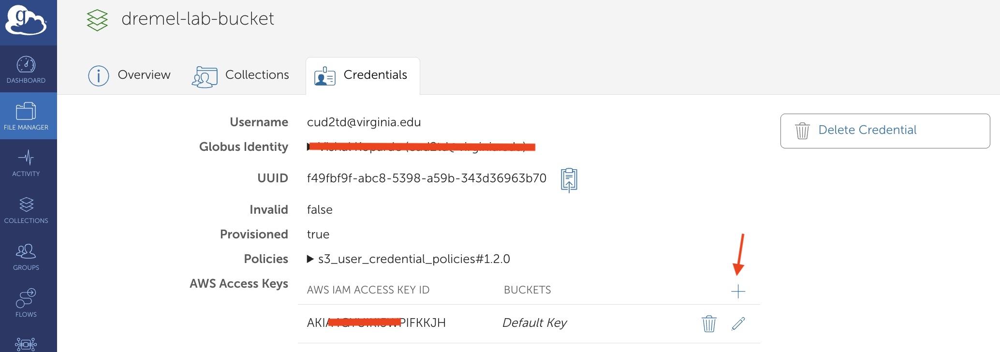
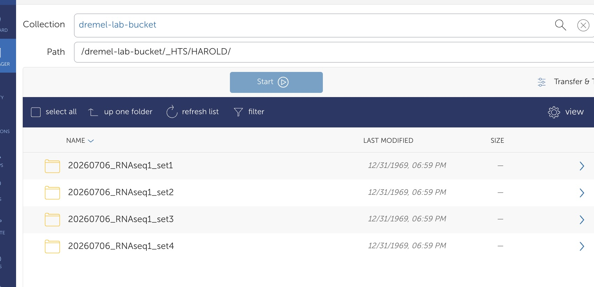

# Getting Access to Dremel Lab S3 Files via Globus

**Time to complete:** 5-10 minutes

**Prerequisites:** Active virginia.edu account with Globus access

---

## Overview

This guide walks you through accessing Dremel Lab's S3 storage via **Globus**, a data transfer platform that provides a web GUI for managing files. 

**Why Globus instead of direct AWS credentials?**

- **GUI interface:** Much easier than command-line AWS tools
- **Centralized access:** Everyone uses Globus with a shared S3 connector—no need to distribute individual AWS accounts
- **Security:** Credentials are managed through UVA's institutional login, not stored locally on your machine

By the end, you'll be able to browse, upload, download, and manage Dremel Lab files through Globus.

---

## Prerequisites

Before you start, make sure you have:

- ✓ **Active UVA computing account** (virginia.edu email)
- ✓ **Part of Dremel Lab** (you should have access to the `#dremellab` Slack channel)
- ✓ **Internet access** to Globus and UVA systems

**If you need AWS SA credentials:** Rivanna users can find them at `/project/dremel_lab/scripts/aws_globus_sa_credentials.txt`. If you don't have Rivanna access, email the lab PI (qdt2nz@virginia.edu (Sarah Dremel)) and they will send you the credentials file.

---

## Step-by-Step Instructions

### Step 1: Access Globus via UVA

1. Open your browser and navigate to **https://www.globus.org/**
2. Click **"Log In"** (top right)
3. In the "Organization" field, type or select **"University of Virginia"**
4. Click the UVA option when it appears

You'll be redirected to the UVA NetBadge login page.

---

### Step 2: Log In with UVA NetBadge

1. Enter your **UVA NetID** (the part before @virginia.edu) and **password**
2. Complete any multi-factor authentication (MFA) if prompted
3. You'll be redirected back to Globus

You should now see the Globus web interface. If you see "Search Collections" or a file transfer page, you're logged in successfully.

> **Tip:** Bookmark https://www.globus.org/ for future logins.

---

### Step 3: Find the Dremel Lab S3 Bucket

1. On the Globus home page, look for the **"Search Collections"** or **"Collections"** field
2. Type **"dremel-lab-bucket"** (or ask your lab PI for the exact collection name if different)
3. Click **Search**
4. The collection should appear in the results

> **If the collection doesn't appear:** You need to request collection access. Open a support ticket at [https://forms.rc.virginia.edu/form/support-request/](https://forms.rc.virginia.edu/form/support-request/) or email [HPC Support](mailto:hpc-support@virginia.edu) requesting access to the `dremel-lab-bucket` Globus collection. This request requires approval from Sarah Dremel (qdt2nz@virginia.edu) before access is granted. Allow 1-2 business days for processing.

---

### Step 4: Connect to the Collection

1. Click on the **"dremel-lab-bucket"** collection when it appears
2. Globus will verify your credentials and access permissions against the S3 connector configuration
3. Once connected, you should see the folder structure inside
4. **Bookmark this collection** for quick access in the future by clicking the bookmark icon

You're now browsing the Dremel Lab S3 files!

Once bookmarked, the collection will appear in your **Bookmarks** tab, so you can easily access it next time without searching:



**Adding S3 Credentials:**

To access the S3 bucket contents, you need to add AWS S3 credentials to Globus:

1. In the Globus File Manager, look for the **"+" button** or **"Manage Credentials"** option in the collection details
2. Click the **"+"** button to add new credentials
3. Select **Amazon S3** as the credential type
4. Enter the AWS Access Key ID and Secret Access Key from the credentials file
5. Save the credentials



Once credentials are added, Globus can access and transfer files from the S3 bucket.

> **Note:** The AWS SA credentials and access permissions are stored in `/project/dremel_lab/scripts/aws_globus_sa_credentials.txt` on Rivanna. Rivanna users can reference this file if needed for direct S3 access or troubleshooting.

---

### Step 5: Test Basic Operations & Understand Folder Structure

**Project Folder Organization:**

The Dremel Lab S3 bucket is organized by project. Pipeline outputs are stored in the **`_HTS/`** folder and its subfolders. Here's a typical project hierarchy:



**Key folders structure:**

- **`_HTS/`** — Contains all high-throughput sequencing (HTS) pipeline outputs
  - **`{pipeline}`** — Name of pipeline that generated this output eg. HAROLD
    - **`{sample_set_name}/`** — Project-specific folders
      - Subfolders depend on **which pipeline was run** to generate the outputs. Common subfolders include:
         - `raw_data/` — Raw sequencing reads
         - `qc/` — Quality control results
         - `alignment/` — Aligned BAM files and indices
         - `counts/` — Gene/transcript count matrices
         - `logs/` — Pipeline execution logs

> **Important:** The exact subfolders under each sample sheet or sample set will vary depending on the specific pipeline used (e.g., RNA-seq pipeline, ATAC-seq pipeline, etc.). 

**Typical Workflow:**

- **Pipeline outputs are automatically uploaded** from Rivanna pipeline runs directly into the `_HTS/` folder—you don't manually upload to this location
- **You download data** from existing HTS outputs for analysis, visualization, or backup
- Write access is limited to avoid accidental modifications of pipeline results

**Test your access:**

1. Browse to the `_HTS/` folder to see the project structure
2. Navigate to an existing sample set folder inside the appropriate pipeline outputs to see the pipeline-generated outputs
3. Select a file from an existing output folder (e.g., a QC report or log file)
4. Try to **download** the file to your computer

If you can browse folders and download files, you have the access you need.

> **Note:** Do not create or modify files in the `_HTS/<PIPELINE>` folder—these are pipeline outputs and should remain unchanged. New data is added only through Rivanna pipeline runs.

---

## What You Can Do Now

With Globus access, you can:

- **Download files** from pipeline outputs in the `_HTS/<PIPELINE>` folder (this is the primary use case)
- **Browse the folder structure** to find your sample sets and results via the web GUI
- **Share files** with lab members via Globus sharing links

**Note:** Pipeline outputs are automatically uploaded from Rivanna to the `_HTS/<PIPELINE>` folder—manual uploads are handled by the pipeline infrastructure, not by individual users.


---

## Understanding S3 Storage Classes & File Restoration

Pipeline outputs in the `_HTS/<PIPELINE>` folder are stored in two different S3 storage classes depending on file size:

### Storage Classes Explained

**Glacier Instant Retrieval (Glacier IR)** — *Downloadable via Globus*

- Smaller files and metadata are stored here
- These files can be downloaded directly through Globus without any delays
- Examples: QC reports, log files, configuration files, small count matrices

**Glacier** — *Requires Restoration*

- Large files (e.g., BAM files, raw sequencing reads, large matrices)
- **Cannot be downloaded directly via Globus**—attempting to download will result in an error
- These files must be restored to temporary Glacier IR objects before downloading

### How to Download Glacier Files

If you try to download a large file and receive an error indicating it's in Glacier storage:

1. **Note the file path and name** from the error message
2. **Email Sarah Dremel** at qdt2nz@virginia.edu with:
   - The file path (e.g., `_HTS/sample-set-name/alignment/file.bam`)
   - Your name and project/sample set
   - Expected download time needed

3. **File restoration process** (handled by Sarah):
   - The file is temporarily copied to a Glacier IR object
   - You'll receive a download link or notification
   - **Download window: 24 hours** from when restoration is complete
   - After 24 hours, the temporary copy is automatically deleted

4. **Download during the 24-hour window** via Globus or direct link

### Example Scenario

```
You try to download: _HTS/my-sample-set/alignment/sample1.sorted.bam
↓
Error: "Object is in Glacier storage class and cannot be accessed"
↓
Email: qdt2nz@virginia.edu with the file path
↓
File is restored to temporary Glacier IR copy
↓
Download within 24 hours
↓
Temporary copy auto-deletes after 24 hours
```

### Important Notes

> ⚠️ **Plan ahead:** File restoration takes a few hours, so request downloads when you know you'll need them soon.  
> ⚠️ **24-hour window:** Make sure to download during the restoration window—the file is only accessible for 24 hours.  
> ⚠️ **Contact early:** If you need multiple large files, email in advance so she can batch-restore them.

---

## Troubleshooting

### "I can't find dremel-lab-bucket in search results"

**Cause:** Collection name might be different, or you don't have permission yet.

**Fix:**

1. Check the exact collection name in the `#dremellab` Slack channel (pinned message or topic)
2. Confirm with your lab PI that you've been added to the collection's access list
3. If still missing after 1-2 hours, contact Research Computing via rc.virginia.edu support

---

### "Permission denied" when trying to access the collection

**Cause:** Your UVA account is authenticated, but you haven't been granted access to this specific collection.

**Fix:**

1. Ask your lab PI or the person who manages the S3 bucket to add your UVA username to the access list
2. Wait 5-10 minutes for permissions to propagate
3. Log out of Globus (top right menu → Log Out) and log back in
4. Try again

---

### "I'm not seeing the Globus transfer page after login"

**Cause:** Browser issue or Globus session timeout.

**Fix:**

1. Clear your browser cache (Ctrl+Shift+Delete or Cmd+Shift+Delete on Mac)
2. Log out of Globus completely
3. Close your browser tab and open a fresh Globus window
4. Log in again

---

### "I don't have a UVA account or Rivanna access"

**Option 1: Use Globus (recommended)**
Email the lab PI (qdt2nz@virginia.edu (Sarah Dremel)) for help getting UVA account access or Globus configured.

**Option 2: Direct S3 access via AWS credentials**

1. Email the lab PI asking for the AWS SA credentials file
2. They'll send you `aws_globus_sa_credentials.txt` (which contains Access Key ID and Secret)
3. Configure your local AWS CLI or SDK with these credentials to access S3 directly
4. This bypasses Globus but requires CLI tools like `aws s3` commands

---

### "Error: Object is in Glacier storage class" or download fails for large files

**Cause:** Large files in the `_HTS/` folder are stored in Glacier storage, which is not directly accessible via Globus.

**Fix:**

1. Note the file path that failed to download
2. Email Sarah Dremel (qdt2nz@virginia.edu) with:
   - The file path (e.g., `_HTS/sample-set-name/alignment/file.bam`)
   - Your name and project
   - When you need to download it
3. Sarah will restore the file to a temporary Glacier IR copy
4. Download the file within the **24-hour window** (see **Understanding S3 Storage Classes & File Restoration** section for details)

**Tip:** If you need multiple large files, ask Sarah to batch-restore them to minimize the number of requests.

---

## Key Points to Remember

> ✓ **No individual AWS accounts:** Everyone uses Globus with the shared S3 connector—simpler and more secure.  
> ✓ **UVA login is your key:** Your virginia.edu credentials authenticate you to Globus and authorize S3 access.  
> ✓ **No downloads needed:** Globus is web-based. You don't need to install anything (unless you use Globus CLI).  
> ✓ **Permissions take time:** If you're newly added to a collection, it may take 5-10 minutes for access to activate.  
> ✓ **AWS SA credentials available:** Rivanna users can find credentials at `/project/dremel_lab/scripts/aws_globus_sa_credentials.txt`. Non-Rivanna users can email the lab PI.  
> ✓ **Ask in Slack if stuck:** The `#dremellab` channel is your fastest way to get help from the team.

---

## Need Help?

- **Slack:** Ask in `#dremellab`
- **Email:** Sarah Dremel, qdt2nz@virginia.edu (qdt2nz)
- **UVA Research Computing:** https://www.rc.virginia.edu/support/

---

**Last updated:** May 2026  
**Maintained by:** Dremel Lab
